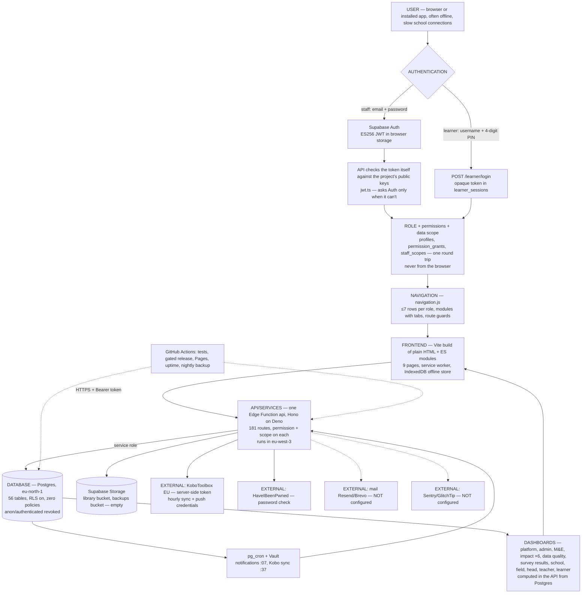

# HPF Learning Portal — audit and improvement backlog

**Second audit: 8 October 2026, evening.** The same 23-point brief as this
morning, re-run after the morning's fixes (section 5). Nothing was changed
to write it. The morning version is in git history (`b1169f1`).

**How it was checked:**
- **Code:** read and measured.
- **Live site and API:** timings and headers.
- **Production database:** read-only queries.
- **Supabase:** the security and performance advisors.
- **Accessibility:** an automated WCAG 2.1 AA check (axe-core 4.10.2) of
  about 70 signed-in screens, covering all 8 roles. The field officer, head,
  teacher, M&E and learner screens were also checked at phone width (375 px).
  The screens ran the real pages against the in-memory test world, so no
  production data was used.

Related: [`NAVIGATION.md`](NAVIGATION.md) (menus), [`RBAC.md`](RBAC.md)
(access model), [`OPERATIONS.md`](OPERATIONS.md) (monitoring, backups,
releases), [`AUTH.md`](AUTH.md), [`../RESTORE.md`](../RESTORE.md).

---

## Summary

The portal is **real end to end**, and there is **no mock or demo data on
any runtime path**:
- Supabase Auth for staff, and PIN sessions for learners stored in Postgres;
- roles, permissions and data scope checked on every API request;
- every screen fed from Postgres through one Edge Function;
- Kobo synced every hour;
- files in Supabase Storage.

Browser storage holds offline copies, the offline queue and preferences,
all by design.

**Since this morning:**
- Kobo data counted on the dashboards went from 38 to **246 of 398**
  submissions, and data quality from 77.9% to 82.9%.
- Signed-in requests skip a 350–400 ms call to Supabase Auth.
- The Platform overview shows operational checks.
- CORS no longer trusts a stranger's site.

**What matters now:**
1. **No backups exist** (P0-1, needs you). The nightly job fails at its
   first step for want of one GitHub secret. The same secret lets releases
   deploy the API.
2. **150 field submissions name two schools the portal doesn't have**
   (P0-2, an admin or M&E decision).
3. **Four owner-only steps:**
   - mail and closed sign-ups (P1-2);
   - error tracking (P1-5);
   - an outside uptime monitor (P1-6) — GitHub runs the 10-minute check only
     every 4–7 hours;
   - a second Super Admin (P1-7).
4. **New: automatic corrections aren't all in the audit log** (P1-8). The
   hourly Kobo run moved 208 submissions from "needs review" to "counted"
   and logged nothing.
5. **New: accessibility.**
   - Primary buttons and status pills fail colour contrast on almost every
     page (3.09:1 and 2.94:1, against 4.5:1 needed).
   - Scrolling tables can't be reached by keyboard.
   - Two controls have no label.
   - All of these come from a few shared styles and helpers (P2-11, P2-12).
6. **Scale and structure** (P2-4, P2-5): a 9,245-line API with 129
   whole-table reads, and a 3,317-line console module.
7. **Adoption** (P2-8): 2 learners, 0 assignments, 0 forms and 0 M&E
   indicators. The dashboards are real but mostly empty.

---

## 1. Architecture map

### Real, local or simulated

| Part | State | Notes |
|---|---|---|
| Staff sign-in | **Real** | Supabase Auth: email + password, temporary passwords, invitation links. Tokens checked in the API against the project's public ES256 key |
| Learner sign-in | **Real** | scrypt PIN hash, `learner_sessions`, lockout after 5 tries |
| Roles, permissions, scope | **Real** | `permissions.ts` plus the database, checked on every route. A failed access read now refuses rather than widening scope |
| Every screen's data | **Real** | `api.js` → Edge Function → Postgres. The browser never touches the database |
| Kobo | **Real** | 3 surveys, 398 submissions: 246 counted, 1 accepted on review, 151 waiting. Synced hourly by pg_cron |
| Files | **Real** | `library` bucket, signed URLs |
| Notifications | **Real** | pg_cron hourly: 24 of 24 runs succeeded in the last day |
| Exports (Excel/CSV/PDF) | **Real** | Built in the browser from live API data |
| Platform health checks | **Real** | 12 checks, including backups, mail, error tracking, sign-ups and Kobo freshness |
| Error reporting | Real code, **off** | No `SENTRY_DSN` |
| Backups | Real code, **failing** | `backup.yml` stops: no `SUPABASE_ACCESS_TOKEN` secret |
| Uptime | **Real, sparse** | Runs, but every 4–7 h, not every 10 min |
| Staging | Ready code, **no project** | The Free plan's 2 projects are both used |
| Mail (invites, password resets) | **Not configured** | No `MAIL_*` secrets, no custom SMTP |
| Airtable | **None** | No code, table or secret |
| Offline copies, queue, drafts | **Local, by design** | IndexedDB plus visit drafts in localStorage, synced to the real API |
| Mock or demo data | **None** | The demo dictionaries were removed this morning. Tests use an in-memory stand-in, never production |
| Fixed lists | **Static, checked** | Grades and visit types live in the pages for offline use; a test fails if they differ from the API's. Library subjects come from the database |

---

## 2. The audit

### 1. Overall architecture
- **Shape:** a multi-page web app with no framework: 9 pages plus a
  workspace template, 42 ES modules. Vite builds it into hashed files; Vercel
  and GitHub Pages serve it.
- **Offline:** a generated service worker and IndexedDB.
- **Backend:** one Supabase Edge Function in front of a locked database.
- **Releases:** CI on every push. Releases go `staging` → tests → production
  → Pages (`release.yml`), all green today.
- **Gap:** the release can't deploy the API or migrations without the
  `SUPABASE_ACCESS_TOKEN` secret. Today they were deployed by hand, so
  production can lag the repository unless someone remembers to deploy.

### 2. Frontend
- **Shared modules:** `nav.js` (menus, tabs, breadcrumb), `api.js`,
  `sync.js` / `offline.js`, `util.js` (skeletons, error and empty states,
  dialogs).
- **Feature modules,** loaded when needed: `admin-ui`, `impact-ui`, `mel-ui`,
  `dq-ui`, `kobo-ui`, `training-ui`, `learners-ui`, `assignments-ui`,
  `reports-ui`, `sync-problems-ui`.
- **JavaScript up front** (minified / gzipped):

  | Page | Up front |
  |---|---|
  | Sign-in | 61 / 21 KB |
  | Console pages (admin, education, M&E, platform) | 47 / 11 KB, the rest on demand |
  | Field | 232 / 69 KB |
  | Head | 276 / 81 KB |
  | Teacher | 279 / 83 KB |

  The field, head and teacher pages include the 100 KB auth library and
  `workspace.js`.
- **Large file:** `console.js`, 3,317 lines (101 KB minified).
- **Inline styles:** 412 `style=""` attributes.

### 3. Backend / API
- **Size:** `index.ts` has 9,245 lines and 181 routes. Rules live in pure
  modules: `lms`, `impact`, `intelligence`, `me`, `data_quality`,
  `kobo_pipeline`, `notifications`, `reports`, `scope`, `permissions`,
  `telemetry`, `jwt`, `mail`, `pwned`.
- **Database access:** the service role only. 129 calls read whole tables
  page by page and aggregate in memory.
- **Location:** the function runs in eu-west-3 (Paris); the database is in
  eu-north-1 (Stockholm).
- **Timing:**
  - a warm `/health` takes 0.74–1.0 s from Kenya, and 1.9 s cold;
  - one query from the function takes 136–198 ms, and 524 ms cold;
  - signed-in requests now skip a 350–400 ms Auth call and one database
    round trip;
  - `Server-Timing` shows the split in the browser's developer tools.
- **Tests:** 370 in 16 files. They cover every route's access rules, school
  and county walls, the domain rules, the token check and CORS. CI keeps the
  output when a test fails.

### 4. Database
- **Tables:** 56 in `public`, plus the 4 Oct RBAC backup schema
  (`backup_20261004_rbac`, 50 tables of personal data). 30 migration files,
  matching production.
- **Live data:**

  | Area | Count |
  |---|---|
  | Places | 24 schools in 4 counties; 9 subjects |
  | Staff | 12 profiles; 13 Auth users (1 without a profile); 1 active Super Admin; 0 waiting for approval; 3 invitations; 3 scope rows; 0 grants |
  | Learning | 2 learners, 1 class; 0 assignments, 0 submissions, 0 forms |
  | M&E | 1 programme, 0 indicators |
  | Programme | 4 trainings, 2 field visits, 3 library items |
  | Kobo | 398 submissions (246 counted) |
  | Data quality | 160 open issues |
  | Logs | 43 audit entries; 175 notification runs; 9 devices reporting sync |

- **Unused:** `assignments_legacy` (empty).
- **Advisors:**
  - security: "RLS on, no policy" (106 tables, informational, by design),
    and the Free-plan leaked-password warning;
  - performance: the backup schema's 50 tables have no primary keys, and
    68 indexes are unused, normal for a database this young and small.

### 5. Authentication
- **Working:**
  - email + password;
  - remember-me;
  - temporary passwords that must be changed;
  - invitation links (copy and send by hand);
  - learner PINs with lockout;
  - the HaveIBeenPwned check on new passwords.
- **Changed today:** staff tokens are verified in the API against the
  project's ES256 public key. Anything it can't verify goes to Supabase Auth.
- **Gaps:**
  - **Password-reset emails fail:** there's no custom SMTP.
  - **Public sign-up is open** (`disable_signup: false`), though an account
    reaches nothing until an admin approves its profile.
  - Google sign-in is off.
  - **New trade-off:** after sign-out, an access token keeps working until
    it expires (Supabase's default is 1 hour), because the API no longer asks
    Auth on every call. Suspension, deactivation and role changes still take
    effect immediately; they're read from the database each time.

### 6. Role-based permissions
- **Model:** 8 roles and a permission per action. Every route checks a
  permission and the data scope, never a role name or anything the browser
  sends. Grants are audited.
- **Super Admin:** has every right. **Only one Super Admin is active**, and
  the Platform overview flags it.

### 7. Navigation
- **Live since 7 Oct** (`NAVIGATION.md`):
  - ≤7 rows per role, modules with tabs and breadcrumbs;
  - one home per function;
  - Super Admin has a system-only menu and Switch workspace;
  - route guards on every page.
- **School pages:** their sections are a proper `nav` with `aria-current`
  since today.
- **Leftover:** the head's own Teachers and Learners pages sit beside the
  Schools module. They're kept because the head *manages* from them.

### 8. Dashboards
- **One per role:**
  - Super Admin: Platform overview;
  - Admin: Administration overview;
  - M&E: overview and results;
  - Education Team: learning;
  - Field Officer: tiles and actions;
  - head, teacher, learner: their own panels.
- **Analytics:** six programme dashboards, the Data Quality Center, survey
  results.
- **State:** all computed from live data. They stay thin until learners,
  assignments and indicators are entered; Kobo is still where most of the
  data is.

### 9. The Platform overview (`platform.html#platform-overview`)
- **Tiles:** staff, sign-ins this week, learners, schools, data quality,
  access exceptions.
- **12 health checks:**
  - Super Admins;
  - field officers placed;
  - heads linked;
  - approvals;
  - Kobo synced in the last 3 h;
  - notifications;
  - data-quality scan;
  - devices;
  - **backup age**;
  - **invitation mail**;
  - **error tracking**;
  - **public sign-ups**.

  The API release and environment are shown beside the checks.
- **Also:** integrations, recent security events, accounts by role.
- **Live, at least 5 checks would fail:** one Super Admin, no backup, no
  mail, error tracking off, sign-ups open. Kobo, notifications and the
  data-quality scan pass.
- **Can't show uptime:** if the API is down, this page can't load either.
  An outside monitor is the only fix (P1-6).

### 10. Data sources
- **Postgres:** everything.
- **Supabase Storage:** library files; backups, once they run.
- **Supabase Auth:** staff accounts.
- **KoboToolbox (EU):** by API token, server-side only.
- **HaveIBeenPwned:** k-anonymity password check.
- **Google Fonts:** loaded without blocking the page.
- **Not connected:** mail, Sentry, Airtable.

### 11. Kobo
- **Pipeline:** raw submission → validation → `kobo_records` (plus issues and
  school aliases) → dashboards and data quality.
- **Who does what:**
  - connection and field mapping: Super Admin;
  - Sync now and re-check: Admin;
  - the hourly sync: pg_cron at :37, with the secret in Vault.
- **Today's fix:** "Aitong primary school" now matches "Aitong Pri". It
  matches when a name's distinctive words are exactly a school's;
  misspellings are only suggested, never linked.

  | Survey | Counted | Waiting |
  |---|---|---|
  | Teach2030 Adoption Barrier Survey | 38 | 1 |
  | SUMMA Endline | 208 | 150 |
  | Classroom Observation | 0 | 1 |

- **The 150 SUMMA submissions:**
  - **Ilkerin primary school** (105) and **Ilmonchin primary school** (44),
    which aren't portal schools;
  - 1 with no school at all.
- **Live push:**
  - credentials were made on 7 Oct, but no submission has ever arrived by
    push (all 398 came by sync);
  - Kobo hasn't received a new submission since 3 Oct, so it may simply have
    had nothing to send;
  - the hourly sync covers it either way.
- **Audit gap (new):**
  - the hourly run writes to the audit log only when submissions are added,
    changed or removed in Kobo, not when a re-check changes a submission's
    result (the 208 today);
  - neither run's audit entry records the per-survey counts;
  - the data-quality side *was* logged: 208 issues auto-resolved, each with
    an event.

### 12. Airtable
**None:** no code, no table, no secret. If it's ever needed, it should be
fed *from* the portal as a reporting copy.

### 13. Supabase integration
- **API side:**
  - Auth (admin calls and the public key);
  - Postgres through the API only;
  - Storage with signed URLs;
  - pg_cron, pg_net and Vault (two hourly jobs, 0 failed calls in 24 h);
  - one Edge Function.
- **Browser side:** only Auth and Storage, through pinned and bundled
  `@supabase/auth-js` and `@supabase/storage-js`.
- **Tools:** the CLI is linked. The claude.ai Supabase connector works.

### 14. Browser storage
- **localStorage:**
  - the Supabase session;
  - `hpf_remember_me`;
  - the learner token;
  - `hpf_device_id`, `hpf_nav_rail`;
  - visit drafts;
  - the last email or username per role;
  - a pending invite and role during sign-up;
  - Kobo "opened" markers.
- **sessionStorage:** the session, when remember-me is off.
- **IndexedDB:** API copies per account, the offline queue, files saved for
  offline, and sync events.
- **None of it is mock data.** The tokens are protected by the strict CSP:
  no inline or third-party scripts. Signing out clears the account's copies.

### 15. Charts and analytics
- **Charts:** hand-rolled bars, comparisons, a donut and trends, with no
  chart library.
- **Accessible:**
  - bars are HTML with text values;
  - the survey donut reads out every answer since today;
  - small numbers (<5) are hidden on the impact dashboards.
- **Gap:** the tables beside the charts scroll sideways but can't be
  reached by keyboard (§22).

### 16. Responsive and mobile
- **Phone width:** at 375 px, no page scrolls sideways. The field officer,
  head, teacher, M&E, learner and sign-in screens were checked today; the
  console pages on 7 Oct.
- **Layout:** the sidebar becomes a drawer; tables scroll inside their own
  frame.
- **Install:** the app installs. The service worker and version are live on
  both hosts (`hpf-4db6958da971`).

### 17. Loading, error and empty states
- **Shared kit:** skeletons, error states with "Try again", empty states,
  friendly messages, the offline banner and the sync chip.
- **Today's check:** no screen was left showing "Loading…" or an error.
- **Minor:** a few first-paint placeholders are still plain text.

### 18. Security and RLS
- **Locked down:**
  - RLS on for all 56 tables, with zero policies; `anon` and
    `authenticated` have no grants;
  - the service-role key exists only inside the function;
  - append-only audit, data-quality, notification and sync event tables;
  - the Kobo token and cron secret never leave the server.
- **Headers:** CSP with script hashes, HSTS for 2 years, `X-Frame-Options:
  DENY`, `nosniff`, a referrer policy and a permissions policy.
- **CORS (fixed today):** our two hosts, our own Vercel previews and
  localhost only.
- **Open points:**
  - public sign-up is open;
  - no backups;
  - the backup schema holds a stale copy of personal data;
  - the sign-out token window (§5);
  - one leftover Auth user without a profile.

### 19. Duplicate functionality
- **Kept on purpose:**
  - the head's Teachers and Learners pages next to the Schools module;
  - Kobo surveys next to the portal's own forms.
- **Lists:** grades and visit types exist in both the pages and the API. A
  test now keeps them equal.
- **Unused, kept:** the `/intelligence` route. The tests use it to check
  the numbers behind the impact dashboards, and it's guarded like `/impact`.
- **Unused, to drop with your OK:** `assignments_legacy`, which is empty.

### 20. Broken or incomplete
- **Not working:**
  - backups;
  - error tracking;
  - password-reset email;
  - invitation email;
  - Google sign-in (off).
- **Weak:** the uptime check runs every 4–7 h instead of every 10 min.
- **Not set up:** staging.
- **Not started:** the M&E framework (0 indicators).
- **Incomplete:**
  - the audit trail of automatic Kobo re-checks (§11);
  - the teacher's CSV learner import: one request per row, no preview, and a
    comma-only parser, so a quoted name like "Wanjiru, Mary" breaks it.
- **Flaky test:** one test failed once in CI and hasn't failed since.

### 21. Performance
- **Sign-in page:** Lighthouse 98 on mobile, 96 on slow 3G (7 Oct).
- **API:**
  - one Auth call and one database round trip fewer per signed-in request;
  - still Paris → Stockholm for every query;
  - dashboards read whole tables, which is fine at today's size but won't be
    at thousands of learners or submissions.
- **Bundles:** the teacher and head pages load about 80 KB gzipped before
  showing anything (§2). The console pages start with 11 KB and fetch the
  rest.

### 22. Accessibility
Checked automatically today across about 70 signed-in screens:

| Finding | Where | WCAG | Count |
|---|---|---|---|
| **Primary buttons:** white on orange `#D97A34` = 3.09:1 (needs 4.5:1) | Almost every page | 1.4.3 contrast | every `.btn-primary` |
| **Status pills:** green "Active" 2.94:1, red 3.6:1, orange 3.87:1; data-quality severity pills | Users, account activity, data quality, many lists | 1.4.3 | up to 16 per screen |
| **Scrolling tables can't be reached by keyboard** (`.lms-table-wrap`) | Platform overview, account activity, permissions, assignments, teachers, learning dashboards, field operations, head's results, teacher's results | 2.1.1 keyboard | about 12 screens |
| **Unlabelled question-type dropdown** in the form builder | Admin and Education Team → Forms | 4.1.2 name (critical) | 1 |
| **Unlabelled CSV file input** | Teacher → My learners | 1.3.1 / 4.1.2 (critical) | 1 |

- **Clean:**
  - the sign-in page (0 violations);
  - every other check: labels, images, landmarks, ARIA, headings and
    lists.
- **Manual testing:** a signed-in screen-reader pass hasn't been done.

### 23. UI consistency
- **Inline styles:** 412 inline `style=""` attributes, so spacing varies.
- **Native dialogs:** the teacher's roster edits a learner through **four
  native `prompt()` boxes in a row**, and resets a PIN the same way. Every
  other edit in the portal uses in-app forms or `confirmDialog`.
- **Charts:** two styles (impact bars, the console donut).
- **Headings:** some module pages have their own `<h2>`, and some don't.

---

## 3. Improvement backlog

Priority = the section: **P0** critical · **P1** high · **P2** important ·
**P3** polish. **"Needs you"** marks items only the owner can do: an
account, a key, a payment, or approval to delete data. IDs are kept from
the first audit; closed items are listed in section 5. **New** marks
items found in this second audit.

### P0 — critical

| ID | Current state | Problem | Recommended solution | Files / components | Tables | Risk |
|---|---|---|---|---|---|---|
| P0-1 | No backups exist. The nightly job runs and stops: *Add the SUPABASE_ACCESS_TOKEN repository secret*. The same missing secret means releases don't deploy the API or migrations | Any accident — a bad update, a deleted project — loses everything. Production can lag the repository | **Needs you:** add the secret, run *Nightly database backup* once, record the restore check in `RESTORE.md`. Consider Pro (daily backups, PITR) | `.github/workflows/backup.yml`, `release.yml`, `RESTORE.md` | all | Total data loss until done |
| P0-2 | 246 of 398 Kobo submissions counted. 150 SUMMA Endline submissions name *Ilkerin* (105) or *Ilmonchin* (44), which aren't portal schools; 1 names none | 42% of the endline results are missing from the dashboards and M&E | **Needs an admin or M&E decision:** add the two schools (Schools), or, if Ilmonchin is Olemoncho (NRK-010), add it as an alias on the Kobo review page. The hourly sync re-checks by itself. Then review the last one by hand | Schools module, `kobo-ui.js` (aliases, review) | `schools`, `kobo_school_aliases`, `kobo_records`, `dq_issues` | A wrong alias puts results on the wrong school; aliases are audited and reversible |

### P1 — high

| ID | Current state | Problem | Recommended solution | Files / components | Tables | Risk |
|---|---|---|---|---|---|---|
| P1-2 | No custom SMTP; `disable_signup: false` | Password-reset emails fail; anyone can create a (powerless) Auth user | **Needs you:** `node --env-file=.env scripts/configure-auth.mjs --apply` with a mail-provider key (or `--signups-only` first) | `scripts/configure-auth.mjs`, `docs/AUTH.md` | Auth config | Locked-out users; junk accounts |
| P1-5 | Error tracking built, off | Production errors are invisible | **Needs you:** a Sentry or GlitchTip project; set the `SENTRY_DSN` function secret | — | — | None |
| P1-6 | Uptime runs, but GitHub fires the 10-minute schedule every 4–7 h | An outage can go unnoticed for hours. The Platform overview can't report it, because it needs the API | **Needs you:** a free outside monitor (UptimeRobot, Better Stack, …) on `/functions/v1/api/health`, alerting by email/SMS; keep GitHub's as a backup | `.github/workflows/uptime.yml`, `docs/OPERATIONS.md` | — | None |
| P1-7 | One active Super Admin | If that account is lost or locked, nobody can run the platform | **Needs you:** invite a second trusted Super Admin | — | `profiles` | Lock-out |
| P1-8 **New** | The hourly Kobo run writes to the audit log only when Kobo adds, changes or removes submissions. Today it moved 208 from "needs review" to "counted" and logged nothing. Neither run records per-survey counts | Your rule: every correction must be auditable | Count re-check changes (`updated`) as "moved"; store each survey's added / changed / removed / updated / counted / waiting in the `kobo.synced` entry, for both Sync now and the hourly run; a test for each | `supabase/functions/api/index.ts` (`runKoboSync`, `/kobo/sync`, `/kobo/sync/run`), `authz_test.ts` | `audit_log` | None — append-only |

### P2 — important

| ID | Current state | Problem | Recommended solution | Files / components | Tables | Risk |
|---|---|---|---|---|---|---|
| P2-4 | 129 whole-table reads; dashboards aggregate in memory | Slower and slower as data grows; timeouts at thousands of rows | Move dashboard aggregates to SQL (views or RPC), paginate lists, check indexes; one dashboard at a time, with tests comparing old and new numbers | `index.ts`, `impact.ts`, `intelligence.ts`, `data_quality.ts` | `learners`, `assignment_submissions`, `kobo_records`, `library_interactions`, … | Medium — numbers must match |
| P2-5 | `index.ts` 9,245 lines / 181 routes; `console.js` 3,317 lines | Hard to change safely; every cold start loads everything | Split by domain (users, schools, learning, kobo, mel, dq, sync, reports) with no behaviour change, in steps; move the console's remaining pages into lazy modules | `supabase/functions/api/*`, `console.js` | — | Medium — the route-coverage test catches misses |
| P2-6 | No staging project | Changes reach production after tests but without a rehearsal | **Needs you:** Pro, a freed project slot, or another account; then `scripts/bootstrap-staging.mjs` | `bootstrap-staging.mjs`, `environments.json` | all (structure only) | Low |
| P2-7 | Invitation emails can't send | Admins copy and send links by hand | Comes with P1-2 (`configure-auth.mjs` sets `MAIL_*`) | — | — | Low |
| P2-8 *(revised)* | Teachers can already add learners from a CSV (*My learners*). It sends one request per row, shows no preview, and splits on commas only. Heads and admins can't import for a school; no staff import. Programme data is nearly empty | Slow and fragile on school connections; the people who onboard schools can't use it; the dashboards stay empty | Improve the existing importer, not a second one: a real CSV parser; a preview with problems marked; one server-side batch route that is idempotent (re-running adds nothing twice) and writes one audit entry; then offer the same importer to heads and admins for a whole school. Plus an onboarding checklist on the Admin dashboard, and M&E's first indicators | `teacher.js`, `learners-ui.js`, `index.ts` (batch route), `admin-ui.js` | `learners`, `learner_enrollments`, `audit_log`, `me_*` | Medium — duplicates and PINs must be handled |
| P2-10 | `assignments_legacy` (empty) and `backup_20261004_rbac` (50 tables, 4 Oct personal data) still exist | A stale copy of personal data; advisor noise | **Needs you:** OK to drop both, after P0-1 (a backup must exist first) | migration | `assignments_legacy`, `backup_20261004_rbac.*` | Data deletion — only with your OK |
| P2-11 **New** | Primary buttons 3.09:1; status pills 2.94–3.87:1 (WCAG AA needs 4.5:1) | Hard to read in sunlight and for low vision; fails WCAG on almost every page | Darken the shared tokens: the button background (or bold large text), and the pill text colours (`--success`, `--danger`, `--accent-fg`); check light and dark themes; re-run axe | `base.css`, `app.css` | — | Low — a visible colour change, so check the brand look |
| P2-12 **New** | Scrolling tables can't be reached by keyboard; the form builder's question-type dropdown and the teacher's CSV file input have no label | Keyboard and screen-reader users can't read wide tables or use two controls | Make `.lms-table-wrap` a labelled, focusable region in the shared table helper; label the two controls; add an axe check to the browser-check routine | the table wrappers in `admin-ui`, `assignments-ui`, `console`, `dq-ui`, `impact-ui`, `kobo-ui`, `mel-ui`, `sync-ui`, `sync-problems-ui` (better: one helper in `util.js`); `console.js` form builder; `teacher.html` | — | None |
| P2-13 **New** | 160 open data-quality issues: 152 "missing school" (the Kobo ones), plus 8 others — 1 duplicate staff, 1 staff without a school, 2 invalid grades, 2 learners without a class, 2 Kobo submissions missing required answers | The score (82.9%) and some lists carry known errors | **Needs an admin:** work through them in the Data Quality Center; most are one edit each. The rest follow P0-2 | Data Quality Center | `dq_issues`, `profiles`, `learners`, `kobo_records` | Low; every change is audited |

### P3 — polish

| ID | Current state | Problem | Recommended solution | Files / components | Tables | Risk |
|---|---|---|---|---|---|---|
| P3-1 | 412 inline `style=""` attributes | Spacing and sizes vary; harder theming | A few utility and component classes, page by page | `*.html`, `*.js`, `app.css` | — | Low |
| P3-6 | One Auth user without a profile | Clutter | Leave, or **with your OK** remove it in the dashboard | — | `auth.users` | None |
| P3-7 | Google sign-in off | Optional convenience | **Needs you:** three dashboard steps (README → "Turning on Google sign-in") | — | — | None |
| P3-8 | The head's own Teachers and Learners pages beside the Schools module | Two looks for the same data | Reuse the Schools module's read-only tabs inside the head's pages; keep their management tools | `leader.js`, `admin-ui.js` | — | Low |
| P3-9 | Teacher and head pages load ~80 KB gzipped up front (including the 100 KB auth library); `console.js` 101 KB | Slower first open on weak connections | Load the auth library and later sections after first paint, as the console pages do; comes naturally with P2-5 | `teacher.js`, `leader.js`, `field.js`, `vite.config.js` | — | Low — the offline start-up must keep working |
| P3-10 | Leaked-password advisor warning | Advisor noise | Covered by the portal's own check; switch Supabase's on with Pro | `configure-auth.mjs` | — | None |
| P3-11 **New** | The teacher's roster edits a learner through four native `prompt()` boxes, and resets PINs the same way | Clumsy on phones, can't be styled or labelled, unlike every other edit | An inline edit form (like the library's) and the in-app dialog for PINs | `teacher.js` | `learners` (unchanged) | Low |
| P3-12 **New** | Since tokens are checked in the API, a signed-out token works until it expires (default 1 hour) | A token copied before sign-out could still be used for up to an hour; suspensions are unaffected | Shorten the access-token lifetime to 15–30 min (refresh keeps people signed in); `configure-auth.mjs` can set it. Or ask Auth on the few most sensitive routes | `configure-auth.mjs`, `jwt.ts` | Auth config | Low — more refreshes on bad connections |
| P3-13 **New** | Kobo push credentials made on 7 Oct; nothing has ever arrived by push | Unclear whether push is set up in Kobo | **Needs you:** add the REST Service in Kobo with the portal's credentials, or remove them; the hourly sync covers it either way | Kobo page (Super Admin) | `kobo_config` | None |
| P3-14 **New** | The function runs in Paris, the database in Stockholm | Every query crosses Europe (measured 136–198 ms per query from the function) | Ask Supabase support how to pin the function to eu-north-1 (the `x-region` header didn't move it) | — | — | None |

---

## 4. Recommended order

1. **Safety first — owner steps, about an hour in all:**
   - P0-1 the GitHub secret, then one backup run (also unblocks API
     releases);
   - P1-2 run `configure-auth.mjs` (mail, closed sign-ups);
   - P1-5 the Sentry DSN;
   - P1-6 an outside uptime monitor;
   - P1-7 a second Super Admin.
2. **Data decisions — an admin or M&E, under an hour:**
   - P0-2 Ilkerin and Ilmonchin (adds up to 149 submissions);
   - P2-13 the 8 other data-quality issues;
   - P3-13 Kobo push, while in Kobo.
3. **Small fixes — one release, mine to do on your word:**
   - P1-8 audit the Kobo re-checks;
   - P2-11 contrast;
   - P2-12 keyboard and labels;
   - P3-11 the roster's edit form.
4. **Adoption:** P2-8 the improved importer for teachers, heads and admins;
   the onboarding checklist; M&E's first indicators. The dashboards only
   show what's entered.
5. **Room to grow:**
   - P2-4 SQL aggregates, one dashboard at a time;
   - then P2-5 split the API and console, behind the test suite, with P3-9
     alongside.
6. **Environment:**
   - P2-6 staging, once the plan is decided;
   - P2-10 the clean-up, after a backup exists.
7. **Polish:** P3-1, P3-8, P3-12, P3-14, P3-6, P3-7, P3-10, in any order.

Each step goes out the same way: one change at a time, tested, released
through `staging`, deployed, and checked in the browser for the affected
roles, now including an axe accessibility pass.

---

## 5. Progress

### 8 October

Released through `staging`, with the API deployed by hand (the release
can't deploy it until the `SUPABASE_ACCESS_TOKEN` secret exists). The test
suite grew from 359 to 370 tests.

| ID | Status | What changed |
|---|---|---|
| P0-1 | **Needs you** | The nightly backup ran on schedule and stopped at its first step: *Add the SUPABASE_ACCESS_TOKEN repository secret*. The Platform overview now shows when the last backup was made. |
| P0-2 | **Mostly done** | The school question in *Learner Assessment Tool – SUMMA Endline* gives labels like "Aitong primary school". The matcher now links a name whose distinctive words are exactly a school's ("Aitong primary school" = "Aitong Pri"); misspellings are still only suggested. After the first hourly sync: **208 of 358 counted** (was 0). **Needs an admin or M&E decision:** the other 150 are *Ilkerin primary school* (105) and *Ilmonchin primary school* (44), which aren't portal schools — add them, or alias Ilmonchin to Olemoncho (NRK-010) if they're the same school — plus 1 with no school. |
| P1-1 | Done | `configure-auth.mjs` reads the URL and key from `environments.json` again; `--check` works. |
| P1-2 | **Needs you** | Run `node --env-file=.env scripts/configure-auth.mjs --apply` with a mail-provider key (or `--signups-only`). The Platform overview shows whether sign-ups are closed and mail is set up. |
| P1-3 | Done | Staff tokens are checked in the function against the project's public ES256 keys (`jwt.ts`). Anything it can't check goes to Supabase Auth as before. The profile, grants and scope rows are read in one round trip. Measured live: asking Auth costs 350–400 ms per request, and a genuine token now skips it; one database round trip from the function is 150–600 ms, and one fewer is needed. The `Server-Timing` header shows `auth;desc="local"` and the times in the browser's developer tools. A failed grants/scope read now refuses with 503 instead of counting as "nothing assigned", which gave admin, M&E and Education Team every school. **Not done:** (b) a per-isolate actor cache — it would delay a suspension by its lifetime, and the parallel reads already removed that round trip; (d) the region pin. |
| P1-4 | Done | pg_cron runs `POST /kobo/sync/run` at 37 past every hour (Vault secret, like the notifications job). It's in the audit log only when something arrived, changed or failed. |
| P1-5 | **Needs you** | Set the `SENTRY_DSN` function secret. |
| P1-6 | Done | Uptime runs on its schedule now (6 runs on 7–8 Oct, all passing). An outside monitor on `/health` is still worth adding. |
| P1-7 | **Needs you** | Invite a second Super Admin. |
| P2-1 | Done | The library's subject pickers (upload and edit) use `GET /subjects`; an item keeps its own subject when edited. |
| P2-2 | Done, differently | The pages keep their copy of the grades and visit types, because a field officer's visit form must work offline. `lists_test.ts` fails the build if they differ from the API's. Content types exist only in the pages. |
| P2-3 | Done | New checks: last backup, invitation mail, error tracking, public sign-ups, and Kobo synced in the last three hours. The API release and environment are shown beside them. |
| P2-9 | Done | CI keeps the API test output and a JUnit report when a test fails, and lists the failing tests in the run summary. |
| P2-10 | Partly | The `/intelligence` route stays: the tests use it to check the numbers the impact dashboards are built on, and it's guarded and scoped like `/impact`. **Needs you:** OK to drop `assignments_legacy` and the `backup_20261004_rbac` schema, once a backup exists. |
| P3-2 | Done | School-page sections are a `nav` with `aria-current`. |
| P3-3 | Done | The survey donut's label reads out each answer, its count and its share. |
| P3-4 | Done | The demo dictionaries are gone from `data.js`. |
| P3-5 | Done | CORS allows the production Vercel host, this team's `-hpf1` previews, GitHub Pages and localhost. It used to allow any `learning-portal*.vercel.app`, including `learning-portal.vercel.app`, which is someone else's site. |

Still open: P2-4 SQL aggregates, P2-5 splitting the monoliths, P2-6
staging, P2-7 invite mail (with P1-2), P2-8 bulk import, P3-1 inline
styles, P3-6–P3-10.

### 8 October, evening — second audit

The brief was re-run against the live portal (sections 1–4 above). New
items: P1-8 (Kobo re-checks not audited), P2-11 (contrast), P2-12
(keyboard access and labels), P2-13 (8 data-quality issues for an admin),
P3-11 (the roster's native prompts), P3-12 (sign-out token window), P3-13
(Kobo push), P3-14 (region). Revised: P1-6 (uptime runs, but sparsely),
P2-8 (a teacher CSV import already exists; improve and extend it rather
than build a second one). No code was changed for the audit.

