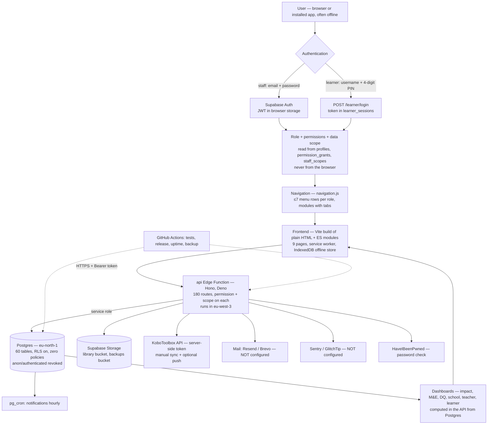

# HPF Learning Portal — audit and improvement backlog

**Date:** 8 October 2026. **Status:** audit only — nothing was changed to
write it. Every number below was read from the code, the live site or the
production database (read-only queries) on this date.

Related: [`NAVIGATION.md`](NAVIGATION.md) (menus, done 7 Oct),
[`RBAC.md`](RBAC.md) (access model), [`OPERATIONS.md`](OPERATIONS.md)
(monitoring, backups, releases), [`AUTH.md`](AUTH.md),
[`../RESTORE.md`](../RESTORE.md).

---

## Summary

The portal is **real end to end**:
- Supabase Auth for staff, and PIN sessions for learners stored in Postgres;
- roles and permissions enforced on every API request;
- every screen fed from Postgres through one Edge Function;
- Kobo data synced into the database;
- files in Supabase Storage.

There is **no mock or demo data on any runtime path**. What's in browser
storage is offline copies, the offline queue and preferences, all by design.

The serious problems aren't fake data. They are:
1. **No backups exist** (P0). The nightly job is ready but waits on a secret.
2. **90% of the Kobo data doesn't reach the dashboards** (P0). 359 of 398
   submissions are stuck needing review.
3. **Things that don't work yet:**
   - password-reset emails (no mail server);
   - public sign-ups are still open;
   - error tracking is off;
   - the uptime schedule hasn't started;
   - the Auth setup script broke with the Vite change.
4. **API speed** (P1): 1–2.7 s per request, because the API runs in Paris
   and the database in Stockholm, with several round trips per request.
5. **Scale and structure** (P2):
   - one 9,069-line API function with 180 routes and 129 whole-table reads;
   - one 3,298-line console module;
   - hard-coded lists that have drifted from the database.

---

## 1. Architecture map

### Real, local or simulated

| Part | State | Notes |
|---|---|---|
| Staff sign-in | **Real** | Supabase Auth: email + password, temporary passwords, invitations |
| Learner sign-in | **Real** | `learners.pin_hash` (scrypt), `learner_sessions`, lockout after 5 tries |
| Roles, permissions, scope | **Real** | `permissions.ts` + `profiles` / `permission_grants` / `staff_scopes`, checked on every route |
| Every screen's data | **Real** | All through `api.js` → Edge Function → Postgres; no direct database access from the browser |
| Kobo | **Real** | 3 active surveys, 398 submissions synced and validated |
| Files | **Real** | Supabase Storage `library` bucket (4 files), signed URLs |
| Notifications | **Real** | pg_cron hourly job (142 runs logged) |
| Exports (Excel/CSV/PDF) | **Real** | Generated in the browser from live API data (`export.js`) |
| Error reporting | Real code, **off** | No `SENTRY_DSN`; browser errors only reach the function log |
| Backups | Real code, **not running** | `backup.yml` needs the `SUPABASE_ACCESS_TOKEN` secret |
| Uptime | Real code, **not started** | GitHub hasn't run the schedule yet |
| Staging | Ready code, **no project** | Free plan's 2 projects are used |
| Mail (invites, resets) | **Not configured** | No mail secrets, no custom SMTP |
| Airtable | **None** | No integration exists |
| Offline copies, queue, drafts | **Local, by design** | IndexedDB (`cache`, `queue`, `blobs`, `meta`), visit drafts in localStorage — synced to the real API |
| Mock or demo data | **None at runtime** | Dead demo dictionaries in `data.js` aren't used anywhere; tests use an in-memory stand-in, never production |
| Hard-coded lists | **Static** | Library subjects (3 vs 9 in the database), visit types, content types, grades |

---

## 2. The audit

### 1. Overall architecture
- **Shape:** a multi-page web app with no framework (9 HTML pages, ES modules),
  built by Vite into hashed files, served by Vercel and GitHub Pages.
- **Offline:** a service worker and IndexedDB.
- **Backend:** one Supabase Edge Function, `api` (Hono), in front of a locked
  database.
- **Releases:** CI on every push. Releases go `staging` → tests → production
  (`release.yml`).

### 2. Frontend
- **Pages:** 9 HTML pages, each with one entry script.
- **Shared modules:** `nav.js` (menus, tabs, breadcrumb, drawer), `api.js`,
  `sync.js` / `offline.js`, `util.js`.
- **Feature modules (loaded when needed):** `admin-ui`, `impact-ui`,
  `mel-ui`, `dq-ui`, `kobo-ui`, `training-ui`, `learners-ui`,
  `assignments-ui`, `reports-ui`, `sync-problems-ui`.
- **Size:** the sign-in page loads 60 KB of JavaScript. Workspaces open with
  about 354 KB, including the sign-in library.
- **Large files:** `console.js` (3,298 lines) holds most of the management
  console; 411 inline `style=""` attributes.

### 3. Backend / API
- **Size:** `supabase/functions/api/index.ts`, 9,069 lines with 180 routes,
  plus pure rule modules: `lms`, `impact`, `intelligence`, `me`,
  `data_quality`, `kobo_pipeline`, `notifications`, `reports`, `scope`,
  `telemetry`, `permissions`.
- **Database access:** all through the service role. 129 calls read whole
  tables page by page (`selectAll`) and aggregate in memory.
- **Location:** the function runs in **eu-west-3 (Paris)**; the database is
  in **eu-north-1 (Stockholm)**.
- **Speed:** a warm `/health` takes 1.1–2.7 s from Kenya. One trivial query
  takes 113–250 ms from the function.
- **Tests:** 358 cover authorization (every route), isolation, rules and
  observability.

### 4. Database
- **Tables:** 60 public tables, plus the RBAC backup schema
  `backup_20261004_rbac` (50 tables).
- **Live data, 8 Oct:**
  - 24 schools, 4 counties, 9 subjects;
  - 12 staff profiles, 13 auth users (1 without a profile);
  - 2 learners, 1 class;
  - 0 assignments, 0 forms, 1 M&E programme with 0 indicators;
  - 4 trainings, 2 field visits, 2 library items;
  - 398 Kobo records (38 counted, 359 waiting for review);
  - 367 open data-quality issues;
  - 43 audit entries.
- **Unused:** `assignments_legacy` is empty.
- **History:** the migration history matches the repository (fixed 7 Oct).

### 5. Authentication
- **Working:** email + password with Supabase Auth; remember-me; temporary
  passwords forced to change; invitation links (copy works).
- **Gaps:**
  - **Password-reset emails fail:** there's no custom SMTP.
  - **Public sign-up is open** (`disable_signup: false`). Anyone with the
    public key can create an Auth user, though nothing is reachable without a
    profile approved by an admin.
  - Google sign-in is off.
  - `scripts/configure-auth.mjs` stopped working in the Vite change: it reads
    the project URL from `config.js`, which now comes from
    `environments.json`.

### 6. Role-based permissions
- **Model:** 8 roles; every route guards on a permission plus a data scope,
  never a role name or anything the browser sends. Grants and revocations are
  audited.
- **Super Admin:** keeps every right, with platform-only controls. **There is
  only one active Super Admin**, and the Platform overview's own check flags
  it.

### 7. Navigation
Redesigned and released 7 Oct (`NAVIGATION.md`):
- ≤7 menu rows per role, modules with tabs and breadcrumbs, one home per
  function;
- Super Admin's menu is system-only, with Switch workspace;
- route guards for every page.

**Leftovers:**
- the school head's own Teachers and Learners pages, kept because they
  *manage*;
- the school-page tabs claim tab-widget roles (`role="tab"`) without the
  keyboard behaviour (§22).

### 8. Dashboards
- **Super Admin:** Platform overview.
- **Admin:** Administration overview, with tiles and "Needs attention".
- **M&E:** M&E overview (empty: no indicators yet).
- **Education Team:** the learning dashboard.
- **Field Officer:** tiles and actions (rebuilt 7 Oct).
- **School head, teacher, learner:** panels with "View all".
- **Analytics:** six programme dashboards (`impact-ui`), the Data Quality
  Center, survey results.

**All of them are computed from live data, but most are near-empty** because
programme data hasn't been entered (2 learners, 0 assignments, 0 forms); Kobo
is where the data is.

### 9. The Platform overview (`platform.html#platform-overview`)
- **Shows:**
  - tiles: staff accounts, sign-ins this week, learners, schools, data
    quality, access exceptions;
  - **8 health checks** (Super Admins, field officers placed, heads linked,
    approvals, Kobo, notifications, data-quality scan, devices);
  - integrations: Kobo, live push, hourly notifications, field devices;
  - recent security events, accounts by role, unplaced field officers.
- **Missing:** the operational state that matters most now: last backup,
  uptime, error tracking, mail, public sign-ups, the API's release and
  environment.

### 10. Data sources
- **Postgres:** everything.
- **Supabase Storage:** library uploads, backups.
- **Supabase Auth.**
- **KoboToolbox:** server-side, by token.
- **HaveIBeenPwned:** k-anonymity password check.
- **Google Fonts:** loaded without blocking the page.
- **Mail, Sentry, Airtable:** not connected.

### 11. Kobo
- **Pipeline:** raw submission → validation → `kobo_records` (+ issues,
  school aliases) → dashboards.
- **Settings:** connection and field mapping are Super Admin's; sync is
  Admin's (since 7 Oct).
- **State:** 3 surveys, 398 submissions. **Only 38 count**; 359 fail checks
  and wait for review. The last sync was 5 days ago: there's no scheduled
  sync, and the live push isn't set up.
- **Cause:** the volume suggests field mapping or school-name matches rather
  than 359 individual bad entries. The pipeline's per-check counts show which.

### 12. Airtable
**None.** No code, table or secret. The README says Airtable, if ever used,
should be fed *from* the portal, as a reporting copy.

### 13. Supabase integration
- **API side:** Auth, Postgres (through the API only), Storage (signed URLs),
  pg_cron + Vault (the notifications job and its secret), Edge Function.
- **Browser side:** only Auth and Storage, through the `@supabase/auth-js` and
  `@supabase/storage-js` client libraries, pinned and bundled.
- **CLI:** linked; `db query` works with the login role.

### 14. Browser storage
- **localStorage:**
  - the Supabase session;
  - `hpf_remember_me`;
  - the learner token (`hpf_learner_token`);
  - `hpf_device_id`, `hpf_nav_rail`;
  - visit drafts (`hpf_visit_draft_<id>`);
  - the last email / username per role;
  - pending invite and role during sign-up;
  - Kobo "opened" markers.
- **sessionStorage:** the same session, when "remember me" is off.
- **IndexedDB `offline.js`:**
  - copies of API replies, per account;
  - the offline queue;
  - files saved for offline;
  - sync events.

**None of it is mock data.** Two notes:
- tokens in localStorage are readable by any script on the page; the strict
  CSP (no inline or third-party scripts) is what protects them;
- signing out removes the account's copies.

### 15. Charts and analytics
- **Charts:** hand-rolled bar, comparison, donut and trend charts, with no
  chart library (light for slow connections).
- **Accessible:** bars are HTML with text values; the M&E trend has an
  accessible name.
- **Not accessible:** the survey-results donut (SVG) has no text
  alternative.
- **Sources:** all from API aggregates. Small numbers (<5) are hidden on the
  impact dashboards.

### 16. Responsive and mobile
- **Layout:** the sidebar becomes a drawer below 860 px; tables scroll inside
  their own frame; module tabs scroll on their own.
- **Phone check:** at 375 px the page itself never scrolls sideways (checked
  7 Oct).
- **Install:** the app can be installed (manifest + service worker).

### 17. Loading, error and empty states
- **Shared kit** (`util.js`): skeleton loaders, error states with "Try
  again", empty states, `friendlyError()`.
- **Connection:** an offline banner, plus the sync chip on every page.
- **Gaps:** some first-paint placeholders are plain "Loading…" text.

### 18. Security and RLS
- **Locked down:**
  - RLS on for **all 60 tables, zero policies**; `anon` and `authenticated`
    have no grants;
  - the service-role key only inside the function;
  - append-only audit, DQ-event, notification-event and sync-event tables;
  - the Kobo token and cron secret never leave the server;
  - strict CSP and HSTS.
- **Advisors:** only the Free-plan leaked-password warning, which the
  portal's own HaveIBeenPwned check covers.
- **Open points:**
  - public sign-up is open;
  - no backups;
  - the API's allowed origins match *any* `learning-portal*.vercel.app` site.
    That's low risk, since no cookies are used, but broader than needed.
  - the RBAC backup schema still holds a copy of personal data from 4 Oct.

### 19. Duplicate functionality (after 7 Oct)
- **Kept on purpose:**
  - the school head's Teachers and Learners pages next to the Schools module
    (they manage the school);
  - Kobo surveys next to the portal's forms (decision 3).
- **Duplicated lists:** visit types in both the frontend and the API.
- **Unused:**
  - the `/intelligence` route, which the impact dashboards replaced;
  - `assignments_legacy`, which is empty.

### 20. Broken or incomplete
- **Not working:**
  - backups;
  - uptime;
  - error tracking;
  - password-reset email;
  - invitation email;
  - `configure-auth.mjs`;
  - Google sign-in (off).
- **Not set up:**
  - staging;
  - a scheduled Kobo sync.
- **Not started:** the M&E framework (0 indicators).
- **Library subjects:** the picker only offers 3 of the 9 subjects.
- **Flaky test:** one API test failed once in CI (~1 in 80 runs) and hasn't
  been reproduced.

### 21. Performance
- **Sign-in page:** Lighthouse 98 on mobile, 96 on a slow 3G profile.
- **API latency** (§3):
  - several sequential round trips per request: Auth `getUser`, the
    profile, grants and scopes, then the data;
  - each one Paris → Stockholm.
- **Growth:** dashboards and lists read whole tables and aggregate in memory.
  That's fine at today's size but won't scale to thousands of learners and
  submissions.
- **Bundle:** `console.js` is the largest single file (≈100 KB).

### 22. Accessibility
- **Sign-in page:** Lighthouse 100.
- **In the code:**
  - inputs are labelled;
  - no images lack `alt` text;
  - status is shown as text, not colour alone.
- **Issues:**
  - the school-page tabs use `role="tab"` without arrow-key handling or tab
    panels;
  - the survey donut has no text alternative;
  - the dashboards haven't had an audit with a signed-in screen reader.

### 23. UI consistency
- **Inline styles:** 411 inline `style=""` attributes, so spacing and sizes
  vary from page to page.
- **Charts:** two chart styles (impact bars, the console donut).
- **Module titles:** some pages have their own `<h2>` and some don't.
- **Fixed already:** the labels, by the navigation work.

---

## 3. Improvement backlog

P0 critical · P1 high · P2 important · P3 polish. **"Needs you"** marks items
only the owner can do: an account, a key, a payment, or approval to delete
data.

### P0 — critical

| ID | Current state | Problem | Recommended solution | Files / components | Tables | Risk |
|---|---|---|---|---|---|---|
| P0-1 | No backups at all (Free plan; `supabase backups list` is empty); nightly job ready | Any accident — a bad update, a deleted project — loses everything | **Needs you:** add the `SUPABASE_ACCESS_TOKEN` GitHub secret, run *Nightly database backup* once, record the restore check in `RESTORE.md`. Consider Pro (daily backups; PITR available) | `.github/workflows/backup.yml`, `RESTORE.md` | all | Total data loss until done |
| P0-2 | 398 Kobo submissions, **38 counted**; 359 wait for review; 367 open DQ issues | Field data — most of the real data — barely reaches the dashboards and M&E | Read the pipeline's per-check counts; fix the **field mapping** (Super Admin) and add **school aliases** for unmatched names; re-check; review what's left. No code expected | `kobo-ui.js` (pipeline panel), `kobo_pipeline.ts` | `kobo_records`, `kobo_record_issues`, `kobo_forms.mapping`, `kobo_school_aliases`, `dq_issues` | Decisions made on ~10% of the field data |

### P1 — high

| ID | Current state | Problem | Recommended solution | Files / components | Tables | Risk |
|---|---|---|---|---|---|---|
| P1-1 | `configure-auth.mjs` reads `config.js`, which no longer holds the URL | The script for mail, sign-ups and redirects fails (`--check` errors) | Read `environments.json` (production) instead; test `--check` | `scripts/configure-auth.mjs` | — | Low |
| P1-2 | No custom SMTP; `disable_signup: false` | Password-reset emails fail; anyone can create Auth users | **Needs you** (mail-provider key): run the fixed `configure-auth.mjs --apply` — SMTP, branded email, sign-ups off, mail secrets for invitations | `scripts/configure-auth.mjs`, `docs/AUTH.md` | Auth config | Users locked out; spam accounts |
| P1-3 | API in Paris, database in Stockholm; 4–6 sequential round trips per request; 1–2.7 s per call | Every page waits; worst on school connections | (a) verify staff JWTs locally with the project's JWKS (the `SUPABASE_JWKS` secret is already injected) instead of an Auth call; (b) a short per-isolate cache of the resolved actor; (c) run the profile, grants and scope reads in parallel; (d) ask Supabase how to pin the function to the database's region (the `x-region` header didn't move it). Measure before and after | `supabase/functions/api/index.ts` (auth middleware, `resolveActor`, `loadAccess`) | `profiles`, `permission_grants`, `staff_scopes` | Auth correctness — the authorization and isolation suites guard it |
| P1-4 | Kobo syncs only when someone presses Sync (last: 5 days ago); live push not set up | Field submissions arrive late; the dashboards lag | A pg_cron job calling a sync route with a Vault secret, like the notifications job (hourly or nightly); and/or set up Kobo's live push (Super Admin) | `index.ts` (scheduled sync route), migration (cron job) | `kobo_*`, `cron.job` | Low; Kobo rate limits |
| P1-5 | Error tracking built, off | Production errors are invisible | **Needs you:** a Sentry or GlitchTip project; set `SENTRY_DSN` | — | — | None |
| P1-6 | `uptime.yml` hasn't run once | No alert if the API goes down | **Needs you:** Actions → Uptime → Run workflow (proves it works and may start the schedule); add an outside monitor on `/health` | `.github/workflows/uptime.yml` | — | None |
| P1-7 | One active Super Admin (the platform check fails) | If that account is lost or locked, nobody can run the platform | **Needs you:** invite a second trusted Super Admin | — | `profiles` | Lock-out |

### P2 — important

| ID | Current state | Problem | Recommended solution | Files / components | Tables | Risk |
|---|---|---|---|---|---|---|
| P2-1 | Library subject picker hard-coded to 3 subjects; the Subjects page manages 9 | Content can't be tagged with 6 of the subjects | Load the picker from `GET /subjects`; keep stored values valid | `console.js` (upload + edit), `data.js` | `subjects`, `library_items` | Low |
| P2-2 | Visit types, content types and grades hard-coded in the frontend (visit types also in the API) | Lists can drift apart; changing one means a release | One source: serve them from the API (one `/meta` route) or a shared module; a table only if they must be edited in the portal | `data.js`, `intelligence.ts`, `field.js`, `console.js`, `leader.js` | (new table only if editable) | Low |
| P2-3 | The Platform overview has no operational checks | The Super Admin can't see that backups, uptime, mail or error tracking are off | Add checks: last backup's age (backups bucket), mail configured, error tracking on, public sign-ups off, API release/environment, last Kobo sync | `index.ts` `/platform/overview`, `admin-ui.js` | `storage.objects` (backups) | Low |
| P2-4 | 129 whole-table reads; dashboards aggregate in memory | Slows and times out as data grows | Move dashboard aggregates to SQL (views or RPC functions), add pagination to lists, check indexes with the advisors; one dashboard at a time, results compared with the current ones | `index.ts`, `impact.ts`, `intelligence.ts`, `data_quality.ts` | `learners`, `assignment_submissions`, `kobo_records`, `library_interactions`, … | Medium — numbers must match; tests compare |
| P2-5 | `index.ts` 9,069 lines / 180 routes; `console.js` 3,298 lines | Hard to change safely; one cold start loads everything | Split by domain (users, schools, learning, kobo, mel, dq, sync, reports) into route modules with no behaviour change, in steps; the console's remaining pages into their own lazy modules | `supabase/functions/api/*`, `console.js` | — | Medium — the route-coverage test catches missed routes |
| P2-6 | No staging project (Free plan: 2 projects, both used) | Changes reach production after tests but without a rehearsal on real-shaped data | **Needs you:** choose Pro, a freed slot, or another account; then `bootstrap-staging.mjs` | `scripts/bootstrap-staging.mjs`, `environments.json`, `vercel.json` | all (structure only) | Low |
| P2-7 | Invitation emails can't send (no mail secrets) | Admins must copy and send links by hand | Comes with P1-2 (`configure-auth.mjs` sets `MAIL_*`) | — | — | Low |
| P2-8 | Programme data nearly empty (2 learners, 0 assignments, 0 forms, 0 indicators) | Dashboards and M&E show little; adoption is the blocker, not code | Bulk import (CSV) of learners and teachers per school with a preview and an audit entry; an onboarding checklist on the Admin dashboard; M&E to enter its first indicators | `learners-ui.js`, `index.ts` (import route), `admin-ui.js` | `learners`, `learner_enrollments`, `profiles`, `me_*` | Medium — imports must be idempotent and audited |
| P2-9 | One API test failed once in CI and couldn't be reproduced | A random red build blocks a release | Upload the test output as a CI artifact on failure, so the next occurrence names the test; then fix it | `.github/workflows/test.yml` | — | None |
| P2-10 | Unused: the `/intelligence` route, the empty `assignments_legacy` table, and the `backup_20261004_rbac` schema (50 tables of 4 Oct personal data) | Dead code; a stale copy of personal data | Remove the route. **Needs you:** OK to drop the legacy table and the backup schema (after P0-1, so a backup exists first) | `index.ts`, migration | `assignments_legacy`, `backup_20261004_rbac.*` | Data deletion — only with your OK |

### P3 — polish

| ID | Current state | Problem | Recommended solution | Files / components | Tables | Risk |
|---|---|---|---|---|---|---|
| P3-1 | 411 inline `style=""` attributes | Inconsistent spacing and sizes; harder theming | Replace with a few utility and component classes, page by page | `*.html`, `*.js`, `app.css` | — | Low |
| P3-2 | School-page tabs use `role="tablist"/"tab"` on links | Screen readers announce a tab widget that doesn't behave like one | Use `nav` + `aria-current`, like the module tabs | `admin-ui.js` | — | None |
| P3-3 | Survey-results donut has no text alternative | Not readable by screen readers | `role="img"` + an `aria-label` with the values, or a table beside it | `console.js` (`donutChart`) | — | None |
| P3-4 | Dead demo dictionaries in `data.js` (`TEACHER_CONTENT` …) | Confusing; looks like mock data | Delete them | `data.js` | — | None |
| P3-5 | The API's allowed origins match any `learning-portal*.vercel.app` | Broader than needed | Limit to this team's Vercel scope (`-hpf1.vercel.app`) and the known domains | `index.ts` (CORS) | — | Low — check previews still work |
| P3-6 | One Auth user without a profile (a sign-up never finished) | Clutter | Leave, or **with your OK** remove it in the dashboard | — | `auth.users` | None |
| P3-7 | Google sign-in off | Optional convenience | **Needs you:** three dashboard steps (`README` → "Turning on Google sign-in") | — | — | None |
| P3-8 | The head's own Teachers and Learners pages beside the Schools module | Two looks for the same data | Reuse the Schools module's read-only tabs inside the head's pages; keep their management tools | `leader.js`, `admin-ui.js` | — | Low |
| P3-9 | `console.js` ≈100 KB is the biggest file; workspaces open with ≈354 KB | Slow first open on weak connections | Comes with P2-5; also preload nothing a role doesn't use | `console.js`, `vite.config.js` | — | Low |
| P3-10 | Leaked-password advisor warning (Free plan) | Advisor noise | Covered by the portal's own check; switch Supabase's on with Pro | `scripts/configure-auth.mjs` | — | None |

---

## 4. Recommended order

1. **This week — safety (mostly yours, all small):**
   - P0-1 backups (add the secret, run it once);
   - P1-1 fix `configure-auth.mjs`, then P1-2 mail and sign-ups off;
   - P1-5 Sentry;
   - P1-6 run Uptime once;
   - P1-7 a second Super Admin.
2. **Data you can trust:**
   - P0-2 Kobo mapping and aliases;
   - P1-4 a scheduled Kobo sync;
   - P2-3 operational checks on the Platform overview.
3. **Speed:** P1-3 fewer and closer round trips per request. Measure before
   and after; it helps every page and every role.
4. **Correctness and consistency:** P2-1 subjects, P2-2 one source for the
   fixed lists, P2-9 the flaky test, P2-10 clean-up (after backups exist).
5. **Room to grow:** P2-4 SQL aggregates for the dashboards, then P2-5 split
   the API and console, behind the test suite. P2-6 staging once the plan is
   decided.
6. **Adoption:** P2-8 bulk import and onboarding. The dashboards only show
   what's entered.
7. **Polish:** P3 items, in any order. They're small and independent.

Each step goes out the way the navigation stages did: one change at a time,
tested, released through `staging`, and checked in the browser for the
affected roles.
